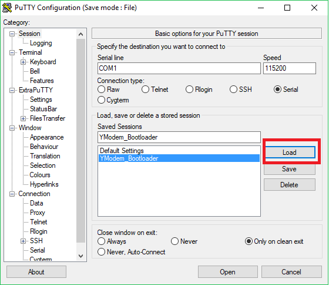
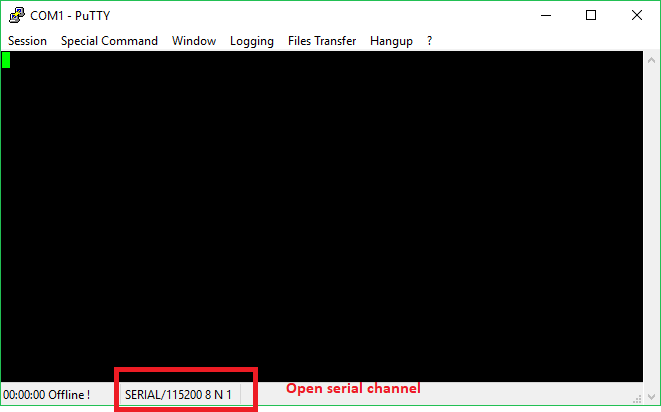
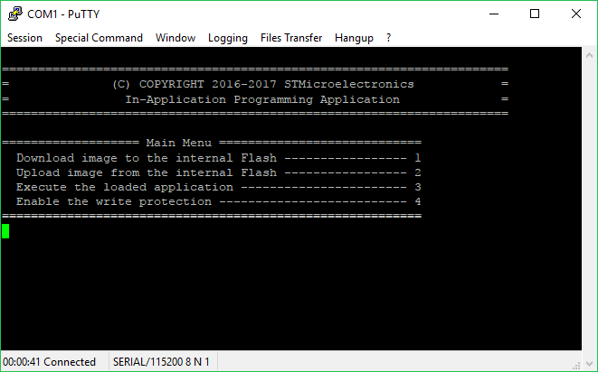
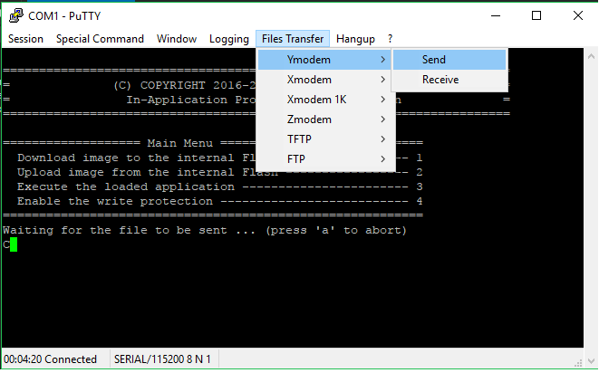

# STM32f779I-EVAL_IAP_bootloader

## Table of Contents
- [Bootloader features](#bootloader-features)
- [Description](#description)
- [Building enviroment](#building_enviroment)
- [References](#references)

## Bootloader features
IAP bootloader for [STM32f779I-EVAL](http://www.st.com/en/evaluation-tools/stm32f779i-eval.html) Evaluation board with STM32F779NI MCU.

Bootloader driver is based on the STM32Cube bootloader implementation by STMicroelectronics team: [STM32Cube_FW_F7_V1.8.0](http://www.st.com/content/st_com/en/products/embedded-software/mcus-embedded-software/stm32-embedded-software/stm32cube-mcu-packages/stm32cubef7.html)

directory in PC: .\Projects\STM32F769I_EVAL\Applications\IAP\..

Bootloader driver only work in the series Flash memory single bank mode.
Original base code can only 1024 * 255 (unsigned char type number) packets received.
New, modified code can 1024 * 65535 (unsigned short type number) packets received.
I tested 285 Kbytes, it is good.

## Building enviroment

[VisualGDB](https://visualgdb.com/) makes cross-platform development with Visual Studio. This is a toolchain for STM32.

Visual Studio 2015

## Description

First time. Programmed binary\bootloader.bin file to the Flash 0x08000000 address width ST-Link (STM32 ST-LINK Utility.exe). Connected to CN22 USB.

The jumper JP5 must be closed.

In card used CN7 USART2 RS232 DB9 connector. This is connected to PC.

Start ExtraPuTTY-0-30\putty.exe terminal program:
 Press the "Load" button and load the YModem_Bootloader session.

Press the "Open" button:

After power-up, the bootloader starts, then the bootloader checks for user-interaction:

If the Tamper button (B2) is pressed and released within 4 seconds: the bootloader tries to update the application firmware.

Running the IAP displays the following menu in the putty.exe window:

Downloading an image into the internal Flash memory
Follow the sequence below to download a binary file via putty.exe into the STM32 internal Flash memory:
1. Press 1 on the keyboard to select the Download image to the internal Flash menu option.
2. Select "Files Transfer/YMODEM/Send" from the putty.exe menu.

3. In putty.exe YMODEM Send dialog window, select the binary file of the application: binary\bootloaderApplication.bin
4. Click the Open button.
5. The IAP bootloader driver then loads the binary file into the internal Flash memory starting from the defined base address and displays the binary file name and size in the Tera Term window.
 
6. Execute the loaded application, press 3 or press Reset button (B1) on card.
7. binary\bootloaderApplication.bin to programmed in Flash at 0x08008000 address. 
8. Ready

## References

[1] Evaluation board with STM32F779NI:  [STM32f779I-EVAL](http://www.st.com/en/evaluation-tools/stm32f779i-eval.html)

[2] VisualGDB "STM32 toolchain": [VisualGDB](https://visualgdb.com/)

[3] AN4657 "STM32 in-application programming (IAP) using the USART": [AN4657](http://www.st.com/content/ccc/resource/technical/document/application_note/27/38/37/58/c2/8c/40/07/DM00161366.pdf/files/DM00161366.pdf/jcr:content/translations/en.DM00161366.pdf)

[4] AN4826 "STM32F7 Series Flash memory dual bank mode": [AN4826](http://www.st.com/content/ccc/resource/technical/document/application_note/group0/d2/bd/77/e8/0d/3a/43/cf/DM00266999/files/DM00266999.pdf/jcr:content/translations/en.DM00266999.pdf)

[5] AN4667 "STM32F7 Series system architecture and performance": [AN4667](http://www.st.com/content/ccc/resource/technical/document/application_note/0e/53/06/68/ef/2f/4a/cd/DM00169764.pdf/files/DM00169764.pdf/jcr:content/translations/en.DM00169764.pdf)

